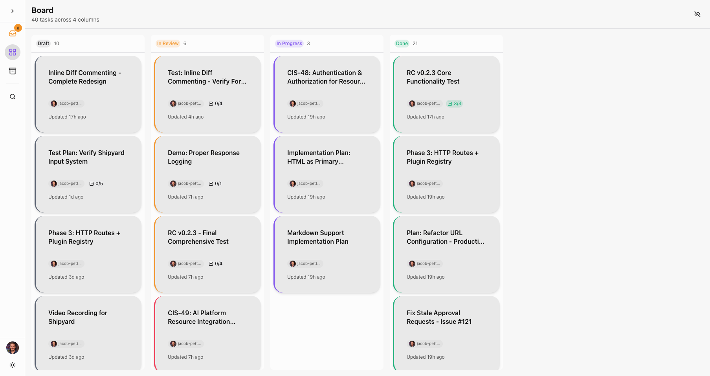
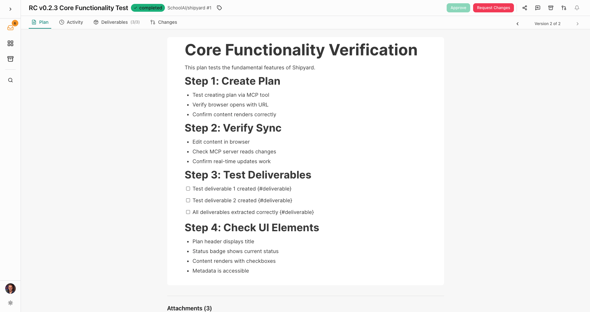

<div align="center">
  
  <h1>Shipyard</h1>
  <p><strong>Ship responsibly.</strong></p>
  <p>Human-agent collaboration with receipts.</p>

  <p>
    <a href="https://github.com/SchoolAI/shipyard/actions"></a>
    <a href="https://www.npmjs.com/package/@schoolai/shipyard-mcp"></a>
    <a href="./LICENSE.md"></a>
    <a href="https://github.com/SchoolAI/shipyard/discussions"></a>
  </p>
</div>

---

<div align="center">
  
  <p><em>Inbox showing tasks needing review with split panel detail view</em></p>
</div>

## The Problem

You're managing multiple AI agents (Claude, Cursor, Devin), but there's no workspace where humans and agents collaborate together:
- **No verification** — Agent says "done" but you have no proof
- **No collaboration layer** — Humans review in GitHub, agents work in chat logs
- **No feedback loop** — You approve work, but the agent never sees it

Shipyard is the collaboration workspace for mixed human-agent teams. Agents create tasks with proof. Humans review in real-time. Feedback flows both ways.

## Why Shipyard

- **Human-agent collaboration** — The first workspace designed for mixed teams. Humans and AI agents work together with structured feedback loops.
- **Built for mixed teams** — Not a human tool with AI bolted on, or an AI tool ignoring humans. Designed for how agents and humans actually work together.
- **Receipts, not promises** — Screenshots, videos, and test results. Not just chat logs claiming work was done.
- **Zero infrastructure** — Works completely locally. GitHub optional for remote artifact sharing. No paid services, no servers to maintain.
- **Real-time P2P** — Multiple agents and reviewers sync via WebRTC. Works offline, no central server required.

## Get Started

Shipyard is just an MCP server. One command or a simple JSON config—works with all major AI coding tools.

**Prerequisite:** Node.js 22+ ([download](https://nodejs.org/))

### Claude Code (Recommended)

Full experience with hooks, skills, and auto-task creation:

```bash
/plugin install SchoolAI/shipyard
```

### Cursor

Add to `~/.cursor/mcp.json`:

```json
{
  "mcpServers": {
    "shipyard": {
      "command": "npx",
      "args": ["-y", "@schoolai/shipyard-mcp@latest"]
    }
  }
}
```

### VS Code / GitHub Copilot

```bash
code --add-mcp '{"name":"shipyard","command":"npx","args":["-y","@schoolai/shipyard-mcp@latest"]}'
```

<details>
<summary><strong>See all platforms (Claude Desktop, Windsurf, JetBrains, Zed, etc.)</strong></summary>

### Claude Desktop

Add to your config file:
- macOS: `~/Library/Application Support/Claude/claude_desktop_config.json`
- Windows: `%APPDATA%\Claude\claude_desktop_config.json`
- Linux: `~/.config/claude/claude_desktop_config.json`

```json
{
  "mcpServers": {
    "shipyard": {
      "command": "npx",
      "args": ["-y", "@schoolai/shipyard-mcp@latest"]
    }
  }
}
```

### Windsurf

Add to `~/.codeium/windsurf/mcp_config.json`:

```json
{
  "mcpServers": {
    "shipyard": {
      "command": "npx",
      "args": ["-y", "@schoolai/shipyard-mcp@latest"]
    }
  }
}
```

### JetBrains IDEs

1. Settings > Tools > AI Assistant > Model Context Protocol (MCP)
2. Click "Add"
3. Paste JSON config above

### Zed

Add to `~/.config/zed/settings.json`:

```json
{
  "context_servers": {
    "shipyard": {
      "command": {
        "path": "npx",
        "args": ["-y", "@schoolai/shipyard-mcp@latest"]
      }
    }
  }
}
```

### Continue.dev

Create `.continue/mcpServers/shipyard.yaml`:

```yaml
mcpServers:
  - name: Shipyard
    command: npx
    args: ["-y", "@schoolai/shipyard-mcp@latest"]
```

</details>

**[Full installation guide with troubleshooting →](./docs/INSTALLATION.md)**

## Platform Support

| Platform | Experience |
|----------|-----------|
| **Claude Code** | Full integration — hooks, skills, MCP tools, auto-task creation |
| **VS Code, Cursor, Windsurf** | MCP tools — manual workflow, full functionality |
| **Other MCP clients** | Basic — depends on platform capabilities |

**[See detailed compatibility matrix →](./docs/INSTALLATION.md#feature-comparison)**

<details>
<summary><strong>Using Shipyard skills on other platforms</strong></summary>

Shipyard includes a skill (`skills/shipyard/SKILL.md`) that teaches Claude Code how to use the MCP tools effectively. Other platforms can use this same instruction content through their native mechanisms:

- **VS Code / Copilot**: Copy to `.github/skills/shipyard/` (Agent Skills preview)
- **Cursor**: Create `.cursor/rules/shipyard.mdc` with skill content
- **Windsurf**: Create `.windsurf/workflows/shipyard-task.md`
- **JetBrains**: Add to `.junie/guidelines.md`

See [skills/shipyard/README.md](./skills/shipyard/README.md) for platform-specific instructions.

</details>

## How It Works

```
┌─────────────────┐     MCP      ┌─────────────────┐
│   AI Agent      │─────────────►│  MCP Server     │
│ (Claude, etc.)  │              │  (localhost)    │
└─────────────────┘              └────────┬────────┘
                                          │ WebSocket
                                          ▼
┌─────────────────┐   WebRTC    ┌─────────────────┐
│ Remote Reviewer │◄───────────►│ Author Browser  │
│    Browser      │   (P2P)     │                 │
└─────────────────┘             └─────────────────┘
```

1. **Agent creates task** via MCP tool → Browser opens automatically
2. **Reviewers join** via shared URL → Real-time P2P sync
3. **Add comments**, approve, or request changes → Agent sees feedback
4. **Agent uploads artifacts** (screenshots, videos) → Stored in GitHub
5. **Task auto-completes** when all deliverables have receipts (screenshots, videos, test results)

## Features

- **BlockNote editor** — Notion-like editing with inline comments and threads
- **Kanban board** — Drag-drop tasks between Draft, Review, In Progress, Done
- **GitHub artifacts** — Screenshots, videos, test results stored in your repo
- **Offline-first** — IndexedDB persistence, works without network
- **Multi-agent** — Multiple Claude Code/Cursor instances can work on same task

<details>
<summary><strong>See more screenshots</strong></summary>

### Kanban Board


### Full Task Detail


</details>

## Data & Privacy

| Data | Where It Lives | Control |
|------|---------------|---------|
| Task content | Browser (IndexedDB) + P2P sync | You own it |
| Artifacts (local) | `~/.shipyard/artifacts/` served via localhost | You own it |
| Artifacts (shared) | Optional: GitHub (your repo, orphan branch) | You own it |
| MCP server | Runs locally | Never leaves your machine |
| URLs | Encoded snapshots | Shareable, regenerable |

**No telemetry. No cloud storage. GitHub optional.**

Works completely locally. Add GitHub only if you need remote reviewers to access artifacts.

## Documentation

| Doc | Description |
|-----|-------------|
| **[Installation](./docs/INSTALLATION.md)** | Platform-specific setup guides |
| **[Setup](./docs/SETUP.md)** | Development setup, troubleshooting |
| **[Architecture](./docs/architecture.md)** | Data model, sync topology, tech choices |
| **[Brief](./docs/BRIEF.md)** | 30-second project context |

## Architecture

Shipyard is a monorepo with multiple components:

| Component | Description |
|-----------|-------------|
| [**MCP Server**](./apps/server) | 12 tools for task creation, artifacts, feedback |
| [**Web App**](./apps/web) | React + BlockNote editor with Kanban board |
| [**Schema**](./packages/schema) | Shared Yjs CRDT types and URL encoding |
| [**WebRTC Signaling**](./apps/signaling) | P2P discovery (Cloudflare Worker) |
| [**Hooks**](./apps/hook) | Claude Code integration |

**Published package:** [`@schoolai/shipyard-mcp`](https://www.npmjs.com/package/@schoolai/shipyard-mcp) - Includes MCP server + hook

## Community

- **[GitHub Discussions](https://github.com/SchoolAI/shipyard/discussions)** — Questions, ideas, show & tell
- **[GitHub Issues](https://github.com/SchoolAI/shipyard/issues)** — Bug reports, feature requests

## Contributing

We value **ideas over implementations**. Please start with discussion:

### How to Contribute

1. **Bug reports** — [Open an issue](https://github.com/SchoolAI/shipyard/issues/new)
2. **Feature ideas** — [Start a discussion](https://github.com/SchoolAI/shipyard/discussions/new)
3. **Questions** — [Ask in discussions](https://github.com/SchoolAI/shipyard/discussions)

### Before Submitting Code

Open an issue describing what you want to change and get maintainer approval first. This helps us:
- Ensure changes align with project direction
- Avoid duplicate efforts
- Provide design guidance upfront

PRs without a linked, approved issue may be closed.

### AI Assistance

AI-assisted contributions are welcome. We use AI ourselves. What matters is that **you** understand what you're submitting and can answer questions about it.

### Learn the Codebase

1. **[Brief](./docs/BRIEF.md)** — 30-second project context
2. **[Engineering Standards](./docs/engineering-standards.md)** — Code quality expectations
3. **[Architecture](./docs/architecture.md)** — How it all fits together

## License

[FSL-1.1-ALv2](./LICENSE.md) (Functional Source License)

- **Free** for all non-competing use
- **Converts to Apache 2.0** automatically in 2 years

---
