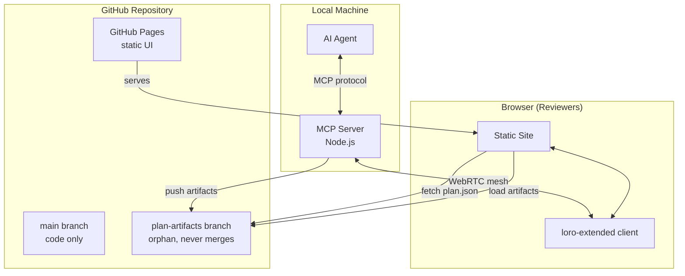
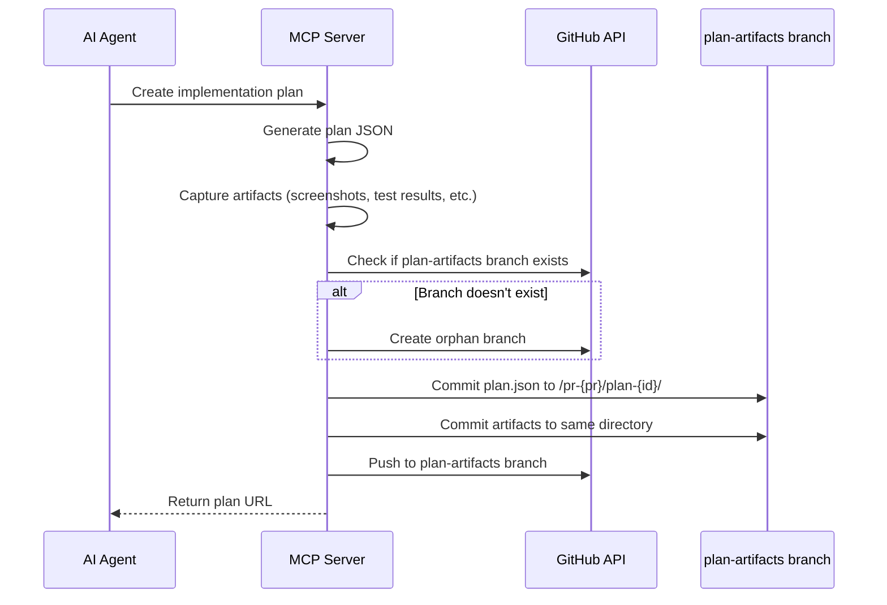
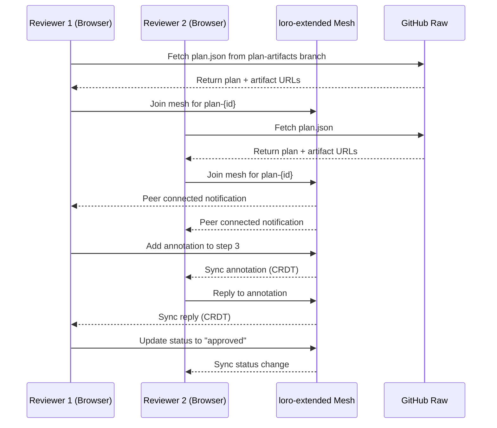
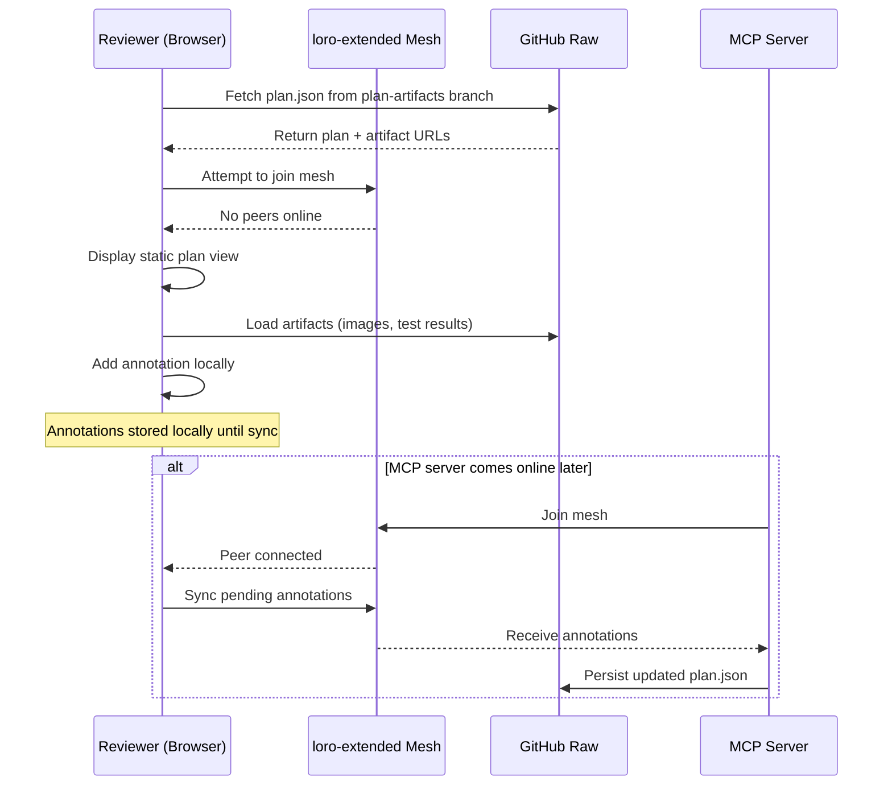
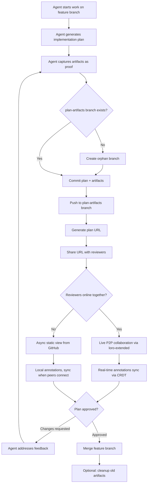
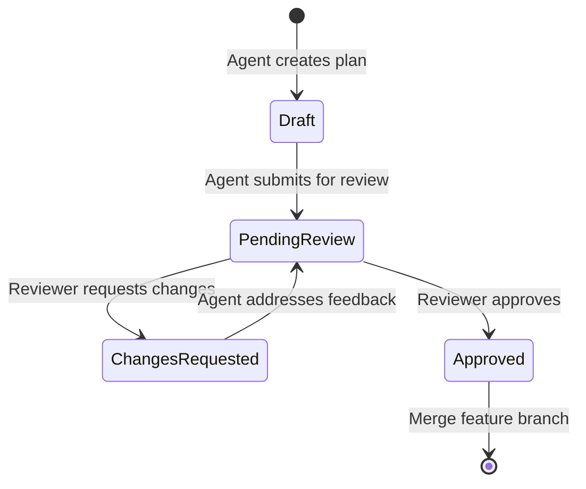
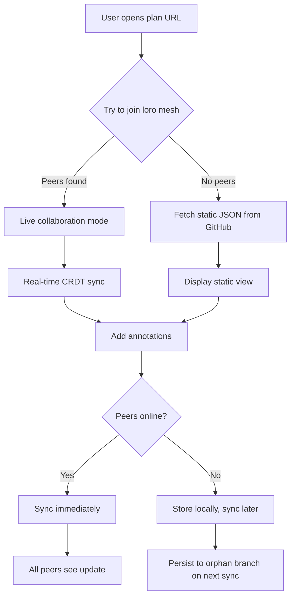

> **ORIGINAL VISION DOCUMENT**
> These diagrams reflect the initial design. Some details have been refined.
> For current architecture, see [../architecture.md](../architecture.md).

---

# Peer-Plan Diagrams (Mermaid)

Render these at [mermaid.live](https://mermaid.live) or any Mermaid-compatible tool.

---

## System Architecture

---

## Sequence Diagram: Plan Creation & Artifact Upload

---

## Sequence Diagram: Collaborative Review (Live)

---

## Sequence Diagram: Async Review (No Peers Online)

---

## Activity Diagram: End-to-End Workflow

---

## State Diagram: Plan Status

---

## Hybrid Live/Async Decision Flow

